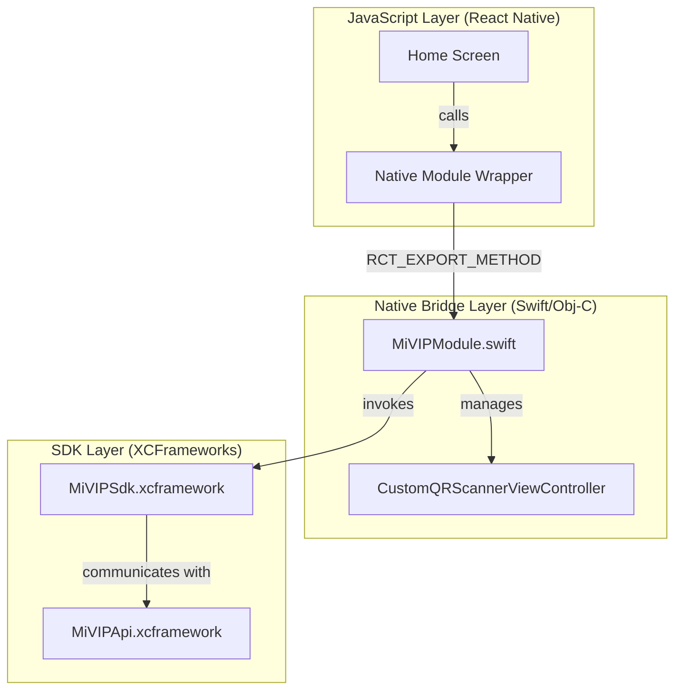

# React Native Bridge Architecture

## Overview
This document describes the architectural pattern used to integrate the MiVIP-iOS SDK into a React Native environment. This pattern is designed to be modular and easily replicable for other hybrid frameworks like Flutter.

## High-Level Diagram



## Key Components

### 1. MiVIPModule (Native Bridge)
A Swift class inheriting from `NSObject` and conforming to `RCTBridgeModule`.
- **Purpose**: Exposes SDK functionality to JS.
- **Methods**:
    - `startRequest(id: String)`: Opens a specific verification request.
    - `scanQRCode()`: Launches the custom native camera UI.
- **Modularity**: This module acts as the "Controller" for the SDK. For Flutter, a similar `MethodChannel` handler would be created.

### 2. Custom QR Scanner
Reuses the `AVFoundation` implementation from the native iOS app.
- **Why**: Bypasses internal SDK parsing limitations.
- **Logic**: Extracts UUID from scanned strings via Regular Expressions before passing to the SDK.

### 3. UI Layer
Built using standard React Native components.
- **Styling**: Uses a central `Theme` object for Mitek branding.
- **Validation**: UUID validation happens in JS before calling the native bridge, ensuring immediate user feedback.

## Hybrid Modularity (Replication Guide)

To replicate this integration for other hybrid frameworks (e.g., Flutter, Kotlin Multiplatform):

### 1. The Native Controller
The logic inside `MiVIPModule.swift` and `CustomQRScannerViewController.swift` is **framework-agnostic**.
- **For Flutter**: Use a `MethodChannel` instead of `RCTBridgeModule`.
- **For KMP**: Use `expect/actual` or a specific iOS native source set.

### 2. Dependency Management
Always use the platform's native dependency manager (CocoaPods for iOS) to pull the MiVIP SDK.
```ruby
pod 'MiVIP', '3.6.15'
```

### 3. UI Mirroring
The 2-card UI layout is standard. Replicate the `Theme` and component structure in the target framework's UI language (Widgets for Flutter, Composable for KMP).
